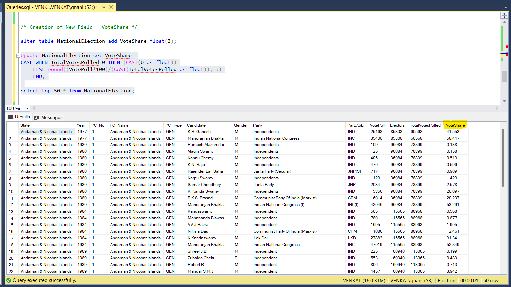
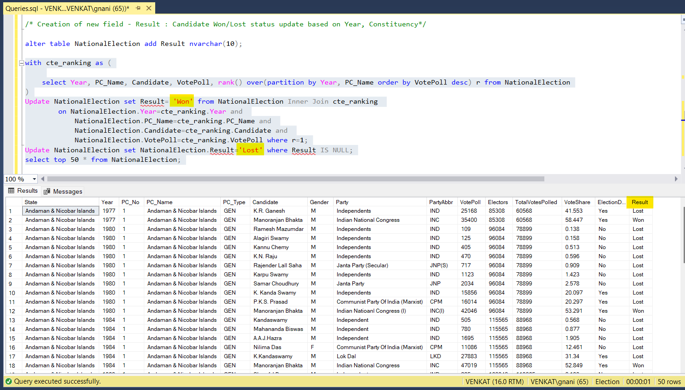

# SQL-Projects

### 1. Election Result Analysis

This project helps to uncover interesting insights from the National Election Result Data set. 

#### Process:
> * Import data set which is comma-separated value file
> * Explore some records of dataset
> * Explore cleansing, formatting to be performed
> * Create new columns as required
> * Validate records to arrive at various queries to be used to extract insights
> * Use Stored Procedures to provide parameters from user input and execute queries

[Introduction to Project](Election_Result_Analysis/README.md#National-Election-Result-Analysis)   
[Use of Analysis in this Project](Election_Result_Analysis/README.md#Use-of-this-Analysis)   
[Database Creation using Data set](Election_Result_Analysis/README.md#Create-DB)  
[Queries Involved in the Analysis](Election_Result_Analysis/README.md#Queries)  
[Triggers Used in the Database](Election_Result_Analysis/README.md#Triggers)  
[Stored Procedures used in the Database](Election_Result_Analysis/Procedures.sql)  
[Screenshots of Query Execution](Election_Result_Analysis/ScreenShots/)  

Score for Improvement:

> * We could use more queries to extract further details from the dataset  
> * More validations can be imposed to improve the quality of data input  
> * A Web Application can be developed making use of this database

#### Sample Snapshots:

  

  

[View More Snapshots](Election_Result_Analysis/ScreenShots/)  
